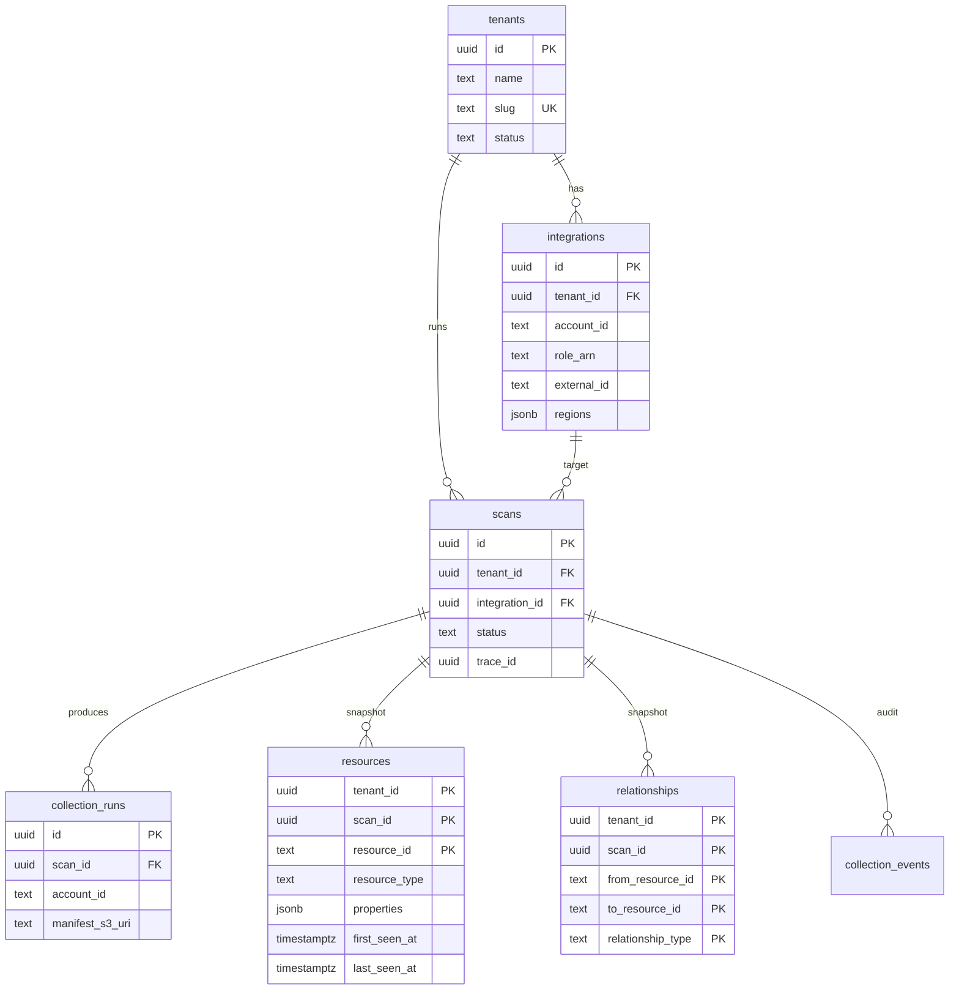

# Platform V2 — Phase 1 schema

**Schemas:** `platform`, `assets` (Phase 1 only)

## ER (Phase 1)



## Scan status lifecycle

```
created → queued → collecting → collected → ingesting → inventory_ready
  → evaluating → completed | completed_with_errors | failed
```

Phase 2+ backend transitions `evaluating` → terminal states when policy runs.

## RLS

Every tenant-scoped table uses `platform.set_tenant(uuid)` per request/worker session.

Policies compare `tenant_id = platform.current_tenant_id()`.

## Tables

| Schema | Table | Notes |
|--------|-------|-------|
| platform | tenants | No RLS (bootstrap/admin) |
| platform | integrations | AWS v1; `external_id` encrypted at app layer |
| platform | scans | Full status enum |
| platform | collection_runs | One row per scan/account |
| assets | resources | Immutable per scan; INSERT only |
| assets | relationships | Graph edges per scan |
| assets | collection_events | Append-only audit |
